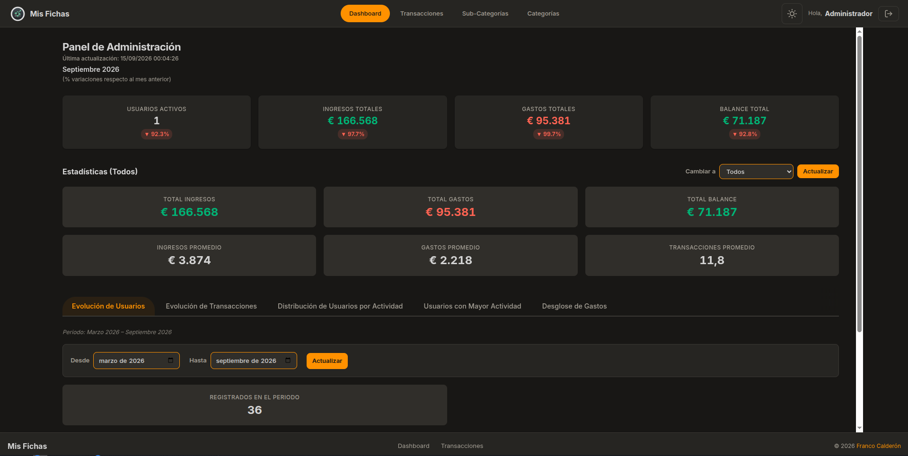

# Mis Fichas

Dashboard financiero personal minimalista. Registra ingresos y gastos, visualiza tus finanzas con gráficos intuitivos y toma decisiones informadas sobre tu dinero. Proyecto educativo y demostrativo de arquitectura frontend modular con **HTML, CSS y JavaScript vanilla** (sin frameworks ni librerías externas).

El frontend consume una **API REST** (`http://localhost:8080/api/v1`) con autenticación JWT, que gestiona usuarios, categorías, subcategorías, transacciones y un dashboard analítico completo. Backend github repo: [api-mis-fichas](https://github.com/FCS-dev/api-mis-fichas)

---

## Screenshots

### Escritorio



| Panel ADMIN: Evolución de registro de USER | Panel ADMIN: Transacciones por meses: INCOMES y EXPENSES |
| ------------------------------------------ | -------------------------------------------------------- |
|                                            |                                                          |

| Panel ADMIN: Tablas comparativas de "Power USERS" | Panel ADMIN: Chart tipo donut sobre EXPENSES: Categorias y Sub-Categorias |
| ------------------------------------------------- | ------------------------------------------------------------------------- |
|                                                   |                                                                           |

---

### Móvil

| Login | Dashboard USER |
| ----- | -------------- |
|       |                |

| Dashboard USER 2 | Menu sidebar |
| ---------------- | ------------ |
|                  |              |

| Modal de registro de Transación |
| ------------------------------- |
|                                 |

---

## Características

### Autenticación y seguridad

- **Login/Registro/Logout** con JWT (access + refresh token en cookie HttpOnly)
- Refresh automático de token antes de expirar
- Roles: USER (gestión personal) y ADMIN (vista consolidada de todos los usuarios)
- Soft delete en usuarios, categorías, subcategorías y transacciones

### Dashboard de usuario

- **Cards de resumen**: totales de ingresos, gastos y balance del mes
- **Gráfico de dona**: distribución de gastos por categoría
- **Gráfico de líneas**: evolución del balance mensual (últimos 12 meses)
- **Comparativas**: ingresos vs gastos del mes actual vs anterior
- **Top gastos**: las subcategorías con mayor gasto
- Selector de mes nativo (`<input type="month">`)

### Dashboard de administrador

- 7 secciones analíticas: evolución de usuarios, evolución de transacciones, top usuarios, movimientos de dinero, distribución de actividad, gastos por categoría/subcategoría y promedios
- Filtrado por usuario y rango de fechas
- Tablas con datos consolidados y estadísticas

### Gestión de transacciones

- **CRUD completo**: crear, listar, editar y eliminar (soft delete) transacciones
- Tipos: INCOME (ingreso) y EXPENSE (gasto)
- Filtros por categoría, subcategoría, fecha exacta y rango de fechas
- Paginación configurable (tamaño de página y ordenamiento)
- Selección de categoría → subcategoría en cascada

### Gestión de subcategorías

- CRUD completo (USER ve las suyas + las del sistema, ADMIN ve todas)
- Asociación a categorías (INGRESO o GASTO)

### Gestión de categorías

- Consulta pública de categorías activas (requiere auth)
- Panel ADMIN: CRUD completo de categorías

### Panel de administración de usuarios

- Listado paginado de usuarios con filtros por rol y estado
- Edición de nombre, email, rol y estado (activo/BLOCKED)
- Eliminación lógica

### UI/UX

- **Tema claro/oscuro** con persistencia en `localStorage`
- **Sidebar** fijo en desktop XL, slide-in con overlay en móvil/tablet
- **Header sticky** que se contrae al hacer scroll
- **Toast notifications** para feedback de acciones (éxito/error)
- **FAB** (botón flotante) para crear transacciones rápido
- **Paginación** reutilizable en todas las listas
- **Modales** responsive: bottom-sheet en móvil, dialog centrado en desktop
- **Responsive design** mobile-first con breakpoints: 641px, 768px, 1024px, 2560px

### Accesibilidad

- Labels en todos los formularios
- Navegación completa por teclado
- Focus visible con ring accesible
- Contraste suficiente en ambos temas

---

## Cómo ejecutar localmente

### Pre-Requisitos

- [Node.js](https://nodejs.org/) (para el backend API)
- Backend `mis-fichas-api` ejecutándose en `http://localhost:8080`
- [Live Server](https://marketplace.visualstudio.com/items?itemName=ritwickdey.LiveServer) (VS Code) o cualquier servidor estático

### Pasos

1. **Clonar y configurar el backend** (`mis-fichas-api`):

   ```bash
   git clone https://github.com/FCS-dev/mis-fichas-api
   cd mis-fichas-api
   npm install
   ```

2. **Configurar el backend** — crear `.env` según las instrucciones del repositorio del backend.
3. **Iniciar el backend**:

   ```bash
   npm run dev
   ```

   El backend corre en `http://localhost:8080/api/v1`.

4. **Configurar el frontend** — editar `config.js`:

   ```js
   const CONFIG = {
     API_BASE: "http://localhost:8080/api/v1",
     CURRENCY: "EUR",
     CURRENCY_SYMBOL: "€",
   };
   ```

5. **Abrir la app** con Live Server (puerto 5501) o cualquier servidor estático.

---

## Arquitectura

Proyecto **vanilla** sin frameworks, build tools ni dependencias de runtime (solo CDN: Chart.js). Scripts cargados secuencialmente en `index.html` con namespace global.

### Estructura de archivos

```
├── index.html              Página principal (carga scripts)
├── css/
│   └── style.css           Design tokens, componentes, responsive ("mobile first"), temas claro/oscuro
├── js/
│   ├── script.js           Entry point: inicializa la app, configura eventos
│   ├── api.js              Fetch wrapper con headers JWT y manejo de errores HTTP
│   ├── auth.js             Login, registro, logout, refresh de token
│   ├── sidebar.js          Sidebar responsive (slide-in móvil, fijo desktop XL)
│   ├── dashboard.js        Lógica compartida del dashboard
│   ├── dashboard-user.js   Dashboard de usuario: cards, gráficos, comparativas
│   ├── dashboard-admin.js  Dashboard de admin: 7 secciones analíticas
│   ├── transactions.js     CRUD de transacciones con filtros
│   ├── subcategories.js    CRUD de subcategorías
│   ├── categories.js       Consulta de categorías activas
│   ├── charts.js           Configuración de gráficos Chart.js (dona, líneas)
│   ├── modal.js            Sistema de modales (bottom-sheet / dialog)
│   ├── toast.js            Notificaciones toast (éxito/error)
│   ├── pagination.js       Componente de paginación reutilizable
│   └── utils.js            Utilidades: fechas, formato moneda, helpers
├── assets/
│   └── logo/               Logo en modo claro/oscuro, iconos
├── config.js               Configuración de la API (URL base, moneda)
└── DESIGN.md               Design system completo (colores, tipografía, componentes)
```

### Diagrama de módulos

```
┌─────────────────────────────────────────────────────────────┐
│                        script.js                            │
│                     (Entry Point)                           │
└─────────┬──────────┬──────────┬──────────┬─────────────────┘
          │          │          │          │
          ▼          ▼          ▼          ▼
    ┌──────────┐ ┌────────┐ ┌────────┐ ┌──────────┐
    │ api.js   │ │auth.js │ │utils.js│ │config.js │
    │ (Fetch)  │ │(JWT)   │ │(Helpers│ │(Config)  │
    └──────────┘ └────────┘ └────────┘ └──────────┘
          │          │          │          │
          ▼          ▼          ▼          ▼
    ┌──────────────────────────────────────────┐
    │              Módulos de UI                │
    ├──────────┬──────────┬──────────┬─────────┤
    │sidebar.js│dashboard │transact. │modal.js │
    │(Nav)     │(Resumen) │(CRUD)    │(Dialog) │
    ├──────────┼──────────┼──────────┼─────────┤
    │toast.js  │charts.js │pagination│subcat.js │
    │(Avisos)  │(Gráficos)│(Pag.)   │cat.js   │
    └──────────┴──────────┴──────────┴─────────┘
```

### Responsabilidades por módulo

| Módulo               | Responsabilidad                                                               |
| -------------------- | ----------------------------------------------------------------------------- |
| `config.js`          | URL base de la API, símbolo de moneda                                         |
| `api.js`             | Fetch con headers JWT, manejo de errores HTTP (401, 429, etc.), refresh token |
| `auth.js`            | Login, registro, logout, gestión de tokens, sincronización de UI              |
| `utils.js`           | Formateo de fechas, moneda, helpers generales                                 |
| `sidebar.js`         | Navegación responsive, toggle del sidebar, overlay en móvil                   |
| `dashboard.js`       | Lógica compartida de dashboard (inicialización, eventos)                      |
| `dashboard-user.js`  | Cards de resumen, gráficos de dona/líneas, comparativas, top gastos           |
| `dashboard-admin.js` | 7 secciones analíticas del admin, tablas, promedios                           |
| `transactions.js`    | Formulario CRUD, filtros, listado paginado de transacciones                   |
| `subcategories.js`   | CRUD de subcategorías, cascada categoría→subcategoría                         |
| `categories.js`      | Consulta de categorías activas, CRUD admin                                    |
| `charts.js`          | Configuración y renderizado de gráficos Chart.js                              |
| `modal.js`           | Sistema de modales (bottom-sheet móvil, dialog desktop)                       |
| `toast.js`           | Notificaciones toast con animación                                            |
| `pagination.js`      | Componente de paginación reutilizable                                         |

---

## Endpoints de la API

Base URL: `http://localhost:8080/api/v1`

### Autenticación (público)

| Método | Ruta             | Descripción                                          | Parámetros                     |
| ------ | ---------------- | ---------------------------------------------------- | ------------------------------ |
| POST   | `/auth/register` | Registrar un nuevo usuario (rol USER)                | Body:`{email, password, name}` |
| POST   | `/auth/login`    | Iniciar sesión (rate-limit en 429, bloqueo temporal) | Body:`{email, password}`       |
| POST   | `/auth/refresh`  | Refrescar access token (rotación de refresh token)   | Cookie HttpOnly                |
| POST   | `/auth/logout`   | Cerrar sesión, revoca refresh token                  | —                              |

### Transacciones (USER y ADMIN)

| Método | Ruta                                        | Descripción                                    | Parámetros query                                                                                     |
| ------ | ------------------------------------------- | ---------------------------------------------- | ---------------------------------------------------------------------------------------------------- |
| GET    | `/transactions`                             | Listar transacciones paginadas                 | `userId`, `categoryId`, `subcategoryId`, `date`, `dateFrom`, `dateTo`, `page`, `size`, `sort`        |
| POST   | `/transactions`                             | Crear nueva transacción                        | Body:`{categoryId, subcategoryId, amount, transactionDate, description?}`, Header: `Idempotency-Key` |
| GET    | `/transactions/{id}`                        | Obtener transacción por ID                     | Path:`id`                                                                                            |
| PUT    | `/transactions/{id}`                        | Actualizar transacción (USER solo las propias) | Path:`id`, Body: `{categoryId, subcategoryId, amount, transactionDate, description?}`                |
| DELETE | `/transactions/{id}`                        | Eliminar transacción (soft delete)             | Path:`id`                                                                                            |
| GET    | `/transactions/category/{categoryId}`       | Listar transacciones por categoría             | Path:`categoryId`, Query: `userId`, `page`, `size`, `sort`                                           |
| GET    | `/transactions/subcategory/{subcategoryId}` | Listar transacciones por subcategoría          | Path:`subcategoryId`, Query: `userId`, `page`, `size`, `sort`                                        |
| GET    | `/transactions/date/{date}`                 | Listar transacciones por fecha exacta          | Path:`date` (ISO), Query: `userId`, `page`, `size`, `sort`                                           |
| GET    | `/transactions/date-range`                  | Listar transacciones por rango de fechas       | Query:`from`, `to` (ISO), `userId`, `page`, `size`, `sort`                                           |

### Subcategorías (USER y ADMIN)

| Método | Ruta                                   | Descripción                                              | Parámetros                                                      |
| ------ | -------------------------------------- | -------------------------------------------------------- | --------------------------------------------------------------- |
| GET    | `/subcategories`                       | Listar subcategorías paginadas (USER: sistema + propias) | Query:`page`, `size`, `sort`                                    |
| POST   | `/subcategories`                       | Crear subcategoría (USER: personal, ADMIN: sistema)      | Body:`{name, categoryId, comments?}`, Header: `Idempotency-Key` |
| GET    | `/subcategories/{id}`                  | Obtener subcategoría por ID                              | Path:`id`                                                       |
| PUT    | `/subcategories/{id}`                  | Actualizar subcategoría (USER solo las propias)          | Path:`id`, Body: `{name, categoryId, comments?}`                |
| DELETE | `/subcategories/{id}`                  | Eliminar subcategoría (soft delete)                      | Path:`id`                                                       |
| GET    | `/subcategories/category/{categoryId}` | Listar subcategorías por categoría                       | Path:`categoryId`, Query: `page`, `size`, `sort`                |

### Categorías (requiere auth)

| Método | Ruta               | Descripción                         | Parámetros                   |
| ------ | ------------------ | ----------------------------------- | ---------------------------- |
| GET    | `/categories`      | Listar categorías activas paginadas | Query:`page`, `size`, `sort` |
| GET    | `/categories/{id}` | Obtener categoría por ID            | Path:`id`                    |

### Dashboard de usuario

| Método | Ruta                                    | Descripción                                                          | Parámetros                                              |
| ------ | --------------------------------------- | -------------------------------------------------------------------- | ------------------------------------------------------- |
| GET    | `/dashboard/me/summary-card`            | Resumen consolidado del mes (ingresos, gastos, balance, saving rate) | Query:`month` (1-12), `year` (requeridos)               |
| GET    | `/dashboard/me/total-income`            | Total de ingresos del mes                                            | Query:`month`, `year` (requeridos)                      |
| GET    | `/dashboard/me/total-expense`           | Total de gastos del mes                                              | Query:`month`, `year` (requeridos)                      |
| GET    | `/dashboard/me/monthly-balance`         | Balance mensual de los últimos N meses                               | Query:`months` (3, 6 o 12, default: 3)                  |
| GET    | `/dashboard/me/expenses-by-category`    | Gastos agrupados por categoría                                       | Query:`month`, `year` (requeridos)                      |
| GET    | `/dashboard/me/expenses-by-subcategory` | Gastos agrupados por subcategoría dentro de una categoría            | Query:`categoryId`, `month`, `year` (requeridos)        |
| GET    | `/dashboard/me/monthly-comparison`      | Glosas comparativas del mes vs anterior                              | Query:`month`, `year` (opcionales, default: mes actual) |
| GET    | `/dashboard/me/top-expenses`            | Top 3 categorías y subcategorías con más gasto                       | Query:`month`, `year` (requeridos)                      |

### Dashboard de administrador

| Método | Ruta                                       | Descripción                                              | Parámetros                                                                                                     |
| ------ | ------------------------------------------ | -------------------------------------------------------- | -------------------------------------------------------------------------------------------------------------- |
| GET    | `/dashboard/admin/stats`                   | Estadísticas generales (usuarios activos, transacciones) | —                                                                                                              |
| GET    | `/dashboard/admin/user-evolution`          | Evolución de usuarios en rango de meses                  | Query:`monthFrom`, `yearFrom`, `monthTo`, `yearTo` (requeridos)                                                |
| GET    | `/dashboard/admin/transaction-evolution`   | Evolución de transacciones en rango de meses             | Query:`monthFrom`, `yearFrom`, `monthTo`, `yearTo` (requeridos), `userId` (opcional)                           |
| GET    | `/dashboard/admin/top-users`               | Top 5 usuarios por actividad                             | Query:`monthFrom`, `yearFrom`, `monthTo`, `yearTo` (requeridos)                                                |
| GET    | `/dashboard/admin/money-movement`          | Movimientos de dinero (ingresos, gastos, balance)        | Query:`userId` (0=todos, opcional)                                                                             |
| GET    | `/dashboard/admin/expenses-by-category`    | Gastos por categoría (admin)                             | Query:`monthFrom`, `yearFrom`, `monthTo`, `yearTo` (requeridos), `userId` (opcional)                           |
| GET    | `/dashboard/admin/expenses-by-subcategory` | Gastos por subcategoría (admin)                          | Query:`categoryId` (requerido), `monthFrom`, `yearFrom`, `monthTo`, `yearTo` (requeridos), `userId` (opcional) |
| GET    | `/dashboard/admin/avg-income`              | Promedio mensual de ingresos (últimos 12 meses)          | Query:`userId` (0=todos, opcional)                                                                             |
| GET    | `/dashboard/admin/avg-expense`             | Promedio mensual de gastos (últimos 12 meses)            | Query:`userId` (0=todos, opcional)                                                                             |
| GET    | `/dashboard/admin/averages`                | Promedios globales y por usuario                         | Query:`userId` (0=todos, opcional)                                                                             |
| GET    | `/dashboard/admin/activity-distribution`   | Distribución de usuarios por nivel de actividad          | Query:`month` (1-12), `year` (requeridos)                                                                      |

### Admin - Gestión de usuarios

| Método | Ruta                | Descripción                                     | Parámetros                                                                   |
| ------ | ------------------- | ----------------------------------------------- | ---------------------------------------------------------------------------- |
| GET    | `/admin/users`      | Listar usuarios paginados                       | Query:`role` (USER/ADMIN), `status` (ACTIVE/BLOCKED), `page`, `size`, `sort` |
| GET    | `/admin/users/{id}` | Obtener usuario por ID                          | Path:`id`                                                                    |
| PUT    | `/admin/users/{id}` | Actualizar usuario (nombre, email, rol, estado) | Path:`id`, Body: `{name, email, role, status}`                               |
| DELETE | `/admin/users/{id}` | Eliminar usuario (soft delete)                  | Path:`id`                                                                    |

### Admin - Gestión de categorías

| Método | Ruta                     | Descripción                      | Parámetros                                                      |
| ------ | ------------------------ | -------------------------------- | --------------------------------------------------------------- |
| GET    | `/admin/categories`      | Listar categorías paginadas      | Query:`page`, `size`, `sort`                                    |
| POST   | `/admin/categories`      | Crear categoría                  | Body:`{name, type}` (INCOME/EXPENSE), Header: `Idempotency-Key` |
| GET    | `/admin/categories/{id}` | Obtener categoría por ID         | Path:`id`                                                       |
| PUT    | `/admin/categories/{id}` | Actualizar categoría             | Path:`id`, Body: `{name, type}`                                 |
| DELETE | `/admin/categories/{id}` | Eliminar categoría (soft delete) | Path:`id`                                                       |

---

## Stack tecnológico

| Capa              | Tecnología                                                            |
| ----------------- | --------------------------------------------------------------------- |
| **Estructura**    | HTML5 semántico (`<dialog>`, `<table>`, `aria-*`, `role`)             |
| **Estilos**       | CSS3 (custom properties, responsive mobile-first, temas claro/oscuro) |
| **Lógica**        | JavaScript vanilla (scripts secuenciales, namespace global)           |
| **Gráficos**      | Chart.js 4.x (CDN)                                                    |
| **Autenticación** | JWT (access + refresh token, cookie HttpOnly)                         |
| **API**           | REST en Java/Spring Boot (`localhost:8080/api/v1`)                    |
| **Moneda**        | EUR (€)                                                               |

---

## Diseño visual

La identidad visual sigue el concepto **"La Ventana Clara"**: minimalismo funcional, sin ruido visual. Colores como herramientas de comunicación (verde=ingreso, rojo=gasto, rojo oscuro=acción). Superficies planas y tonales, jerarquía por tamaño y peso.

Para detalles completos, ver [DESIGN.md](DESIGN.md).

### Paleta de colores

| Color                                   | Uso                                     |
| --------------------------------------- | --------------------------------------- |
| Rojo Principal`#8e2f37`                 | Acción principal (botones, links, foco) |
| Verde Ingreso`#16a34a`                  | Montos de ingreso, badges positivos     |
| Rojo Gasto`#dc2626`                     | Montos de gasto, badges negativos       |
| Ámbar Advertencia`#f59e0b`              | Indicador de actividad "ocasional"      |
| Fondo Página`#e4e4e4` / Dark `#0f172a`  | Superficie base (claro / oscuro)        |
| Fondo Tarjeta`#ffffff` / Dark `#1e293b` | Cards, tablas, sidebar, header          |

### Temas

- **Claro**: fondo gris suave `#e4e4e4`, tarjetas blancas, texto oscuro
- **Oscuro**: fondo azul muy oscuro `#0f172a`, tarjetas `#1e293b`, texto claro
- Persistencia de preferencia en `localStorage`

---

## Derechos de Autor

Mis Fichas es una aplicación web desarrollada por Franco Bonora con fines de demostración académica.

El código fuente está disponible únicamente con fines educativos. No está permitido copiar, redistribuir ni usar este proyecto para fines comerciales sin autorización expresa del autor.

© 2025 Franco Bonora. Todos los derechos reservados.
